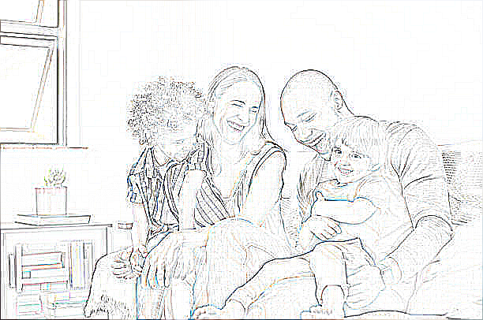

# Pillow Command Editor (P.C.E)

**Pillow Command Editor (P.C.E)** is a simple command-line tool for basic image editing, designed as a learning project to explore and experiment with the Python `Pillow` library. This proof-of-concept application includes a few essential image manipulation features such as applying filters, adjusting brightness and contrast, and mirroring. P.C.E. demonstrates how these effects can transform an image in a straightforward, beginner-friendly project.

---

### Table of Contents
1. [Overview](#overview)
2. [Features](#features)
3. [Installation](#installation)
4. [Usage](#usage)
5. [Examples](#examples)
6. [Contributing](#contributing)
7. [License](#license)

---

## Overview

This project was created to experiment with image processing using the `Pillow` library in Python. Although P.C.E. is a basic editor, it covers foundational image operations that make it a useful starting point for beginners. The command-line interface guides users through options, allowing them to apply filters, adjust image properties, and save the modified image.

## Features

- **Apply Filters:** Blur, Contour, Detail, and Sharpen filters.
- **Adjust Brightness:** Scale brightness between 0.0 (black) to 2.0 (twice as bright).
- **Adjust Contrast:** Scale contrast between 0.0 (completely flat) to 2.0 (high contrast).
- **Mirror Image:** Flip the image horizontally or vertically.
- **Save Image:** Save the edited image to a specified path.

---

## Installation

Before running this project, make sure to have Python installed along with the `Pillow` library. You can install `Pillow` using pip:
```
pip install Pillow
```
Clone or download the project files to your local machine.

---

## Usage

To use P.C.E., run the script from the command line and follow the prompts:
```
python main.py
```
Upon running, you will be asked to input the image path and can then choose options to apply filters or adjustments. Once satisfied, you can save the edited image by selecting the "Save Image" option.

---

## Examples

Below are examples showing the effects of each feature on an image. 

1. **Original Image**  
   

2. **Blur Filter**  
   

3. **Contour Filter**  
   

4. **Detail Filter**  
   

5. **Sharpen Filter**  
   

6. **Brightness Adjustment** (Level 1.5)  
   

7. **Contrast Adjustment** (Level 1.5)  
   

8. **Mirror Image** (Vertical)  
   

---

## Contributing

Since P.C.E. is a learning project, contributions are welcome, especially if they help extend the project’s educational value. Feel free to suggest features, submit pull requests, or report issues!

---

## License

This project is open-source and available under the MIT License.
